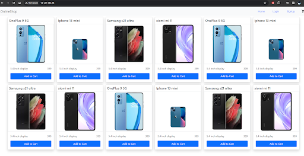

## 🚀 Project Overview

This Capstone project showcases the complete deployment lifecycle of a **React application** using modern DevOps practices. The goal was to create a **production-ready environment** with CI/CD automation, containerization, monitoring, and cloud infrastructure — all built and managed via CLI and scripting.

The application is containerized using Docker, with images pushed to Docker Hub. Jenkins automates the build and deployment pipelines based on GitHub branch triggers. The final deployment runs on an AWS EC2 instance, exposed via port 80 and secured through custom security groups. Application health is monitored in real time using Prometheus and Grafana, with alerting enabled for downtime notifications.

> ✅ CI/CD integrated with GitHub  
> ✅ Docker images pushed to public/private registries  
> ✅ Auto deployment via Jenkins  
> ✅ Live monitoring and email alerts  
> ✅ Hosted on AWS EC2 (Ubuntu)

This project is a hands-on implementation of the full DevOps lifecycle — from source control and containerization to automated delivery and cloud deployment.

👉 **To know more about this project, visit the [GitHub README](https://github.com/amie2001/Capstone-Project/blob/dev/README.md)**.

Pipeline setup

React-App deployment

Monitoring dashboard

